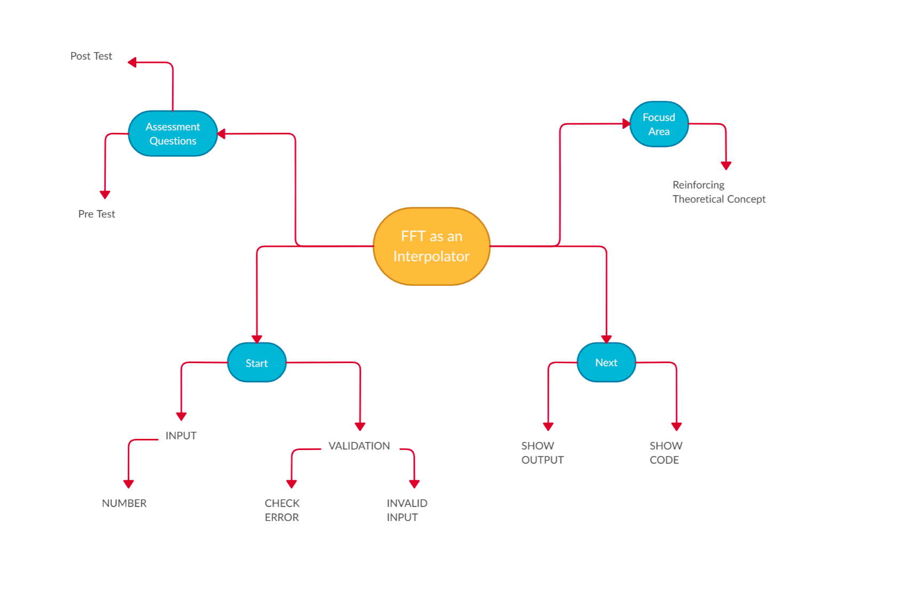

## Storyboard (Round 2)
Experiment: To verify FFT as sample interpolator

### 1. Story Outline:
Digital signal processing is integral part of modern life. It is an important aspect to effective
communications across mobiles, laptops, satellite, video, radio and all communication systems;
signal processing makes the processing and transmission of data more efficient.The
experiment given in this virtual lab is about understanding sampling of signals and analyzing those
signals using fast Fourier transform. 

### 2. Story:

The story for this experiment begins with the user drwing line beween two points. The line describes the behaviour of a function connecting two points. If behavious of the fucntion is linear, then it is very easy to estimate. However, if the behaviour of the function is non-linear then it becomes challanging. 

In the second scene, user tries to model non-linear function of the given samples of data. The challange is even more if user have less data points of samples. the challenge becomes easy if number of sample points are more. In addition to challange based on data points, challange lies in the selection on polynomial. The order of polynomial to usually increased to reduce approximation. Increasing the order of polynomial increses computational complexity. A mathamatician Carl Friedrich Gauss discovered a model for computing coeffcients of a polynomial for interpolation. This model divides interpolating polynomial into smaller subparts of sninusoidal and cosine waveforms.   

In this experiment, user will be able to become familiar with sampling of signals. Signals are the waveforms which carry information. As information has no limit in variety, signals also have no limits in its types. However, to start learners should start from basic signals. Some of the basic signals

#### 2.1 Set the Visual Stage Description:
When any user comes into the simulator, in the first page he/she will learn about the lab, importance of the lab and objectives of the lab. He/she can learn the theory related to the experiment and
algorithm to perform experiments. Users will be able to observe a pre-lab quiz before
performing experiments in the simulator. User will also see a program code of simulator with start button.

#### 2.2 Set User Objectives & Goals:
The main objective of the user is to learn how FFT works as interpolation. He/She will be able observe samples to be interpolated. User will be able to inspect FFT of the samples and perform some exaperiments with concept of fast Fourier transform for interpolation of samples. User should experiment with different data samples also.

#### 2.3 Set the Pathway Activities:

As soon as an user comes to the virtual lab, he/she will first understand
about the lab and about the experiment. After knowing about the experiment he/she will understand objectives of the experiment. User will give pre lab test, perform the experiment. After completion of the experiment, user will be exposed to post experiment quiz. 

##### 2.4 Set Challenges and Questions/Complexity/Variations in Questions:

In order to assure quality of learning, after simulation users are moved to select question level (1) simple (2) moderate and (3) complex 

##### 2.5 Allow pitfalls:
The Simulator is designed to provide maximum ease to the user to understand the programming of MATLAB required for completion of the required task . however, he/she may feel difficult to set proper sample values in the input.

##### 2.6 Conclusion:
In this experiment user will be able to learn FFT as interpolator. He/She will be able to learn the concept in five experiment. Learners should pay attention on the comments appearing with the code for better understanding. Based on the marking recieved by the learner, he/she can undrstand the which leaning outcome (LO) taken along with him.

##### 2.7 Equations/formulas: NA
Type equations here : (guide : ( a separate sheet having equations / programs for the lab exper3ment to be shared along with the Story submissions (1) . You can mark it as numerical reference numbers within the story narration (like we cite in the research papers) and then separately share these equations/programs sheets as a reference, do not include the equations as a whole in the narration))
Tool can be used to integrate formula in Markdown <b> [here](http://latex.codecogs.com/eqneditor/samples/example3.php) </b>

### 3. Flowchart 4
 
 

### 4. Mindmap:

  

### 5. Storyboard :
Storyboard: <a href="Storyboard/carwiper.gif"> [here]</a>
Link to storybaord (.gif file ) here :
(guide: This document should include sketching and description scene wise (duration, action, description). Software to be used for storyboarding : https://wonderunit.com/storyboarder/ (Its a FOSS tool) . tutorial on how to use it https://www.youtube.com/watch?v=LAeCEpG0KX4
